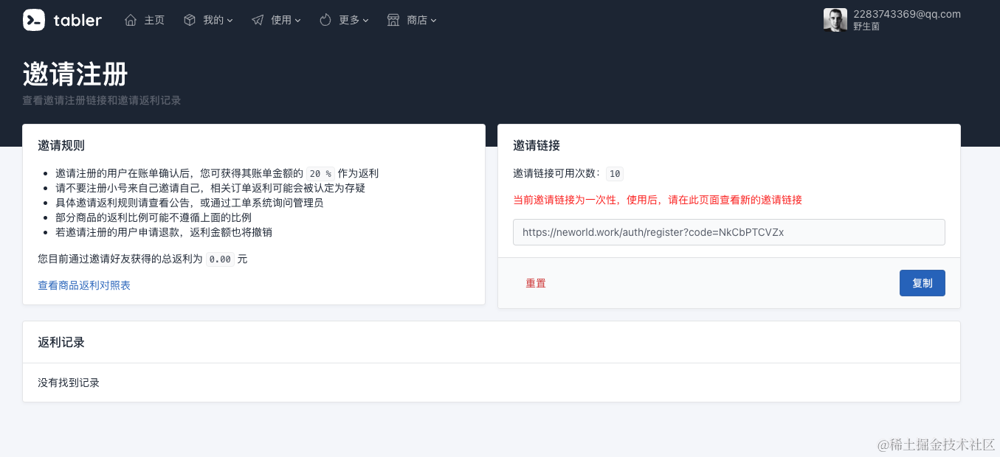
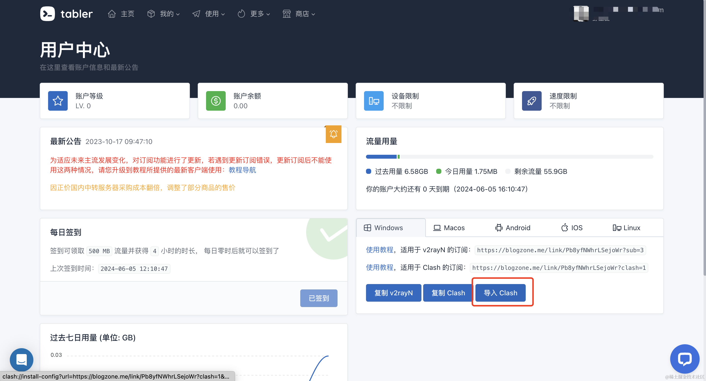
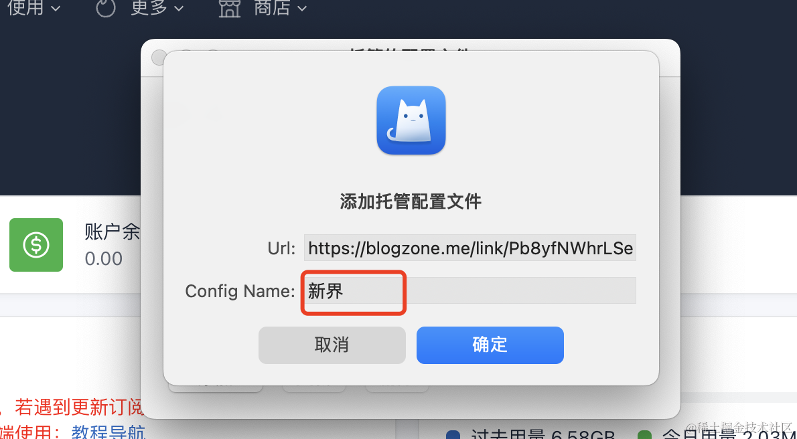
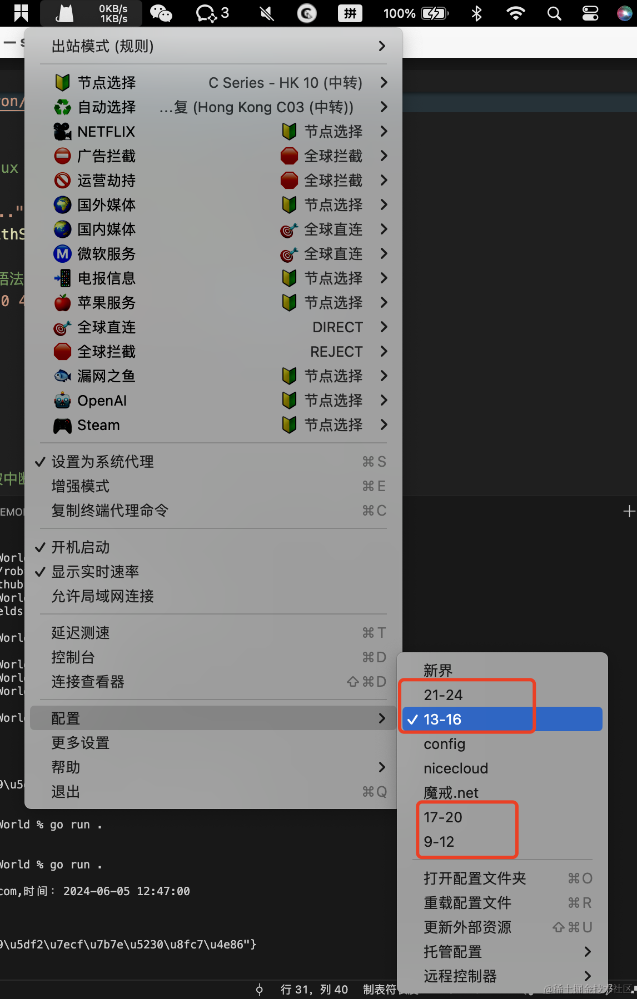
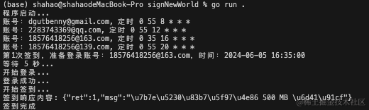

### 科学上网的平台
新界
https://neworld.work/


### 注册账号
由已注册新界的账号生成注册邀请码，需要注册多个账号（大概4到5个账号）
https://neworld.work/user/invite




新注册账号有两天体验时间，这个我们不管，需要的是免费签到


### 下载ClashX
下载这只猫可通过这个地址下载：https://github.com/cfwtf/clashX （备注：这只猫的作者已经跑路了）


下载安装完后，进入新界的界面点击倒入ClashX



导入后编辑你的配置名称，比如我的就会按照时间分类，在不同时间段切换不同的配置来达到免费科学上网的目的。（下面会分享脚本）






### 直接使用
```
./signNewWorld 
```


### 编译使用
```
go build 
或者
go run .
```

