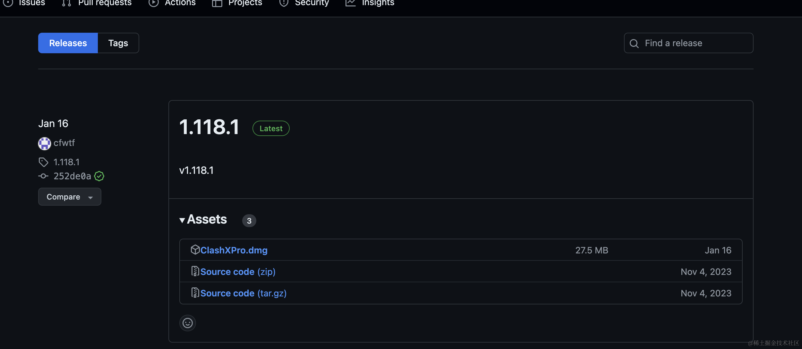

## 简介
这是一个让你免费！科学！上网的脚本。

原理是：定时登录新界并签到，签到获取4小时的免费使用时间，每天手动切换ClashX配置，实现科学上网。

比如我设置的这个脚本会定时每天在8点55分，12点55分，16点55分，20点55分运行脚本（也就是0 55 8,12,16,20 * * *）
### 配置文件
```
## 账号列表
ACCOUNT_PREFIXES=ACCOUNT1,ACCOUNT2,ACCOUNT3,ACCOUNT4
#第一个账号
ACCOUNT1_USER="xxx@gmail.com"
ACCOUNT1_PASS="x"xx
ACCOUNT1_CRON="0 55 8 * * *" # 每天早上8点55分运行
ACCOUNT1_DELAY="240" # 随机延迟240秒，防止ban
#第二个账号
ACCOUNT2_USER="xxxx@qq.com"
ACCOUNT2_PASS="xxxx"
ACCOUNT2_CRON="0 55 12 * * *" # 每天中午12点55分运行
ACCOUNT2_DELAY="240"
#第三个账号
ACCOUNT3_USER="xxx@163.com"
ACCOUNT3_PASS="xxxx"
ACCOUNT3_CRON="0 55 16 * * *" # 每天下午4点55分运行
ACCOUNT3_DELAY="10"
#第四个账号
ACCOUNT4_USER="xxx@139.com"
ACCOUNT4_PASS="xxx"
ACCOUNT4_CRON="0 55 20 * * *" # 每天晚上8点55分运行
ACCOUNT4_DELAY="240"
#more accounts can be added here
```

## 如何使用？

### 先配置好账号密码（后面详细可知怎么获取）
```
copy .env.example .env
```
然后编辑你的多个账号密码
注意：配置文件.env需要在程序的同一目录

### 直接使用
找到你系统的可执行文件，比如我的是：
```
./signNewWorld 
```

### 编译使用
```
make init
make run
```

### 运行项目


## 详细使用
### 科学上网的平台
新界
https://neworld.work/


### 注册账号
由已注册新界的账号生成注册邀请码，需要注册多个账号（大概4到5个账号）
https://neworld.work/user/invite


新注册账号有两天体验时间，这个我们不管，需要的是免费签到


### 下载ClashX
下载这只猫可通过这个地址下载：https://github.com/cfwtf/clashX （备注：这只猫的作者已经跑路了）



下载安装完后，进入新界的界面点击倒入ClashX


导入后编辑你的配置名称，比如我的就会按照时间分类，在不同时间段切换不同的配置来达到免费科学上网的目的。（下面会分享脚本）


## goreleaser打包使用
可访问链接[https://goreleaser.com/quick-start/](https://goreleaser.com/quick-start/)

下载安装goreleaser
```
go install github.com/goreleaser/goreleaser@latest
```
如果只本地打包出可执行文件

```
goreleaser release --snapshot --clean
```

如果需要上传到github并清除dist目录

```
goreleaser release --clean
```


## 写到最后

 * 在这段代码的旅程即将结束之际，我想对每一位阅读到此处的你说一声感谢。
 * 开源不仅是一种精神，更是一场关于分享与协作的旅程。你的每一次使用、
 * 每一个建议、以及每一份贡献，都是推动这个项目前行的宝贵力量。
 * 如果你觉得这段代码曾给予你帮助，或者希望支持这个项目继续成长，
 * 欢迎扫描下方的二维码，给予作者一点鼓励和支持。
 * 你的支持将被铭记于心，并转化为我持续创新和改进的动力。
 * 感谢有你，感恩同行。

 